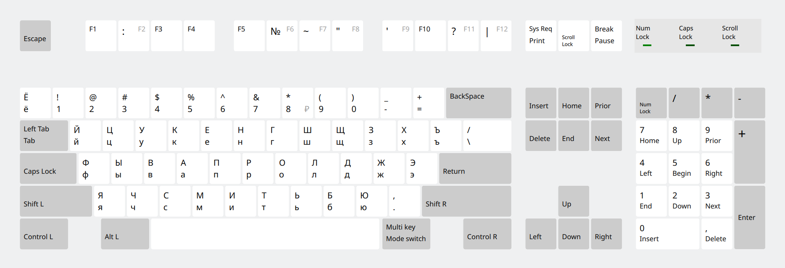

# keyboard-tuning

Кастомная раскладка `winkeys-pd` — вариант русской раскладки «Программист» с классическими цифрами на верхнем ряду.

## Раскладка winkeys-pd

Раскладка основана на «Russian (Programmer)», но возвращает классические цифры 1–0 на верхний ряд. Раскладка доступна в системе как **Russian (Programmer classic digits)**.



### Изменённые клавиши

| Клавиша | Без Shift | С Shift |
|---------|-----------|---------|
| `1`     | 1         | !       |
| `2`     | 2         | @       |
| `3`     | 3         | #       |
| `4`     | 4         | $       |
| `5`     | 5         | %       |
| `6`     | 6         | ^       |
| `7`     | 7         | &       |
| `8`     | 8         | *       |
| `9`     | 9         | (       |
| `0`     | 0         | )       |
| F2      | F2        | :       |
| F7      | F7        | ~       |

## Установка

### Автоматически

```shell
./apply_patch.sh
```

Скрипт создаст бэкапы системных файлов (`.orig`) и применит оба патча.

### Вручную

```shell
sudo cp /usr/share/X11/xkb/symbols/ru /usr/share/X11/xkb/symbols/ru.orig
sudo patch /usr/share/X11/xkb/symbols/ru ./0001-custom-keyboard.patch

sudo cp /usr/share/X11/xkb/rules/evdev.xml /usr/share/X11/xkb/rules/evdev.xml.orig
sudo patch /usr/share/X11/xkb/rules/evdev.xml ./0001-keyboards-list.patch
```

## Откат

Для восстановления оригинальных файлов:

```shell
sudo cp /usr/share/X11/xkb/symbols/ru.orig /usr/share/X11/xkb/symbols/ru
sudo cp /usr/share/X11/xkb/rules/evdev.xml.orig /usr/share/X11/xkb/rules/evdev.xml
```

## Настройка в KDE

После применения патча новая раскладка появится в списке раскладок:

1. Открыть **System Settings → Input Devices → Keyboard → Layouts**
2. Нажать **Add Layout**
3. Найти **Russian (Programmer classic digits)**
4. Включить раскладку

Может потребоваться перезапуск сессии для применения изменений.
